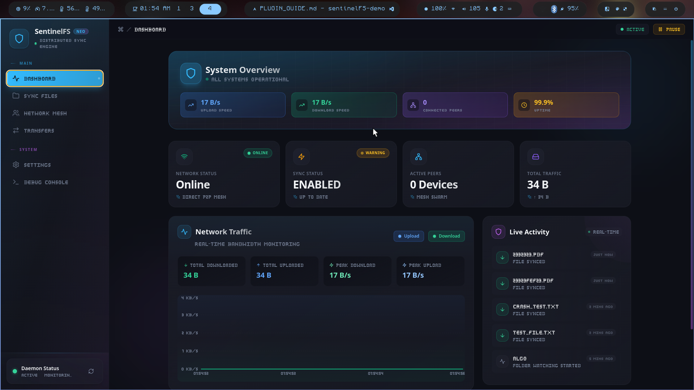

# 🛡️ SentinelFS

**SentinelFS** is a high-performance, secure, and modular **P2P file synchronization system** designed for privacy and efficiency. It eliminates the need for central servers, allowing devices to sync data directly with military-grade encryption.

Built with **Modern C++ (C++17/20)** for the core daemon and **Electron/React** for the user interface, SentinelFS combines raw performance with a modern user experience.

> **Note:** SentinelFS is currently Linux-only. The codebase uses Linux-specific features such as Unix domain sockets, dlopen/dlsym for plugin loading, and other POSIX APIs. Windows and macOS support is not yet implemented.


---

## 📊 Project Statistics

| Metric | Value |
| :--- | :--- |
| **Core Codebase (C++)** | ~16,600 Lines |
| **UI Codebase (TypeScript)** | ~3,000 Lines |
| **Total Source Files** | ~150 Files |
| **Architecture** | Plugin-based P2P Mesh |
| **Encryption** | AES-256-CBC + HMAC |

---

## 🚀 Key Features

### 🔒 Security First
*   **End-to-End Encryption:** All transfers are encrypted using **AES-256-CBC**.
*   **Zero-Knowledge:** No central server stores your data or metadata.
*   **Session Codes:** Secure handshake mechanism ensures only authorized devices join your mesh.

### ⚡ High Performance
*   **Delta Sync Engine:** Transfers only modified blocks using **Adler32** rolling checksums and **SHA-256** verification. Saves up to **99%** bandwidth on large files.
*   **Auto-Remesh:** Intelligent network topology management that automatically heals connections and optimizes routes based on RTT and jitter.
*   **Low Footprint:** Native C++ daemon runs efficiently in the background with minimal resource usage.

### 🧩 Modular Architecture
*   **Plugin System:** Core functionality (Network, Storage, Filesystem, ML) is decoupled into independent plugins.
*   **Anomaly Detection:** Integrated **Machine Learning (ONNX)** module detects suspicious file patterns (e.g., ransomware activity) in real-time.

---

## 📸 Screenshots

| Dashboard | Files | Transfers |
|:---------:|:-----:|:---------:|
|  |  |  |

---

## 🛠️ Technology Stack

### Backend (Daemon)
*   **Language:** C++17 / C++20
*   **Networking:** Boost.Asio (Async I/O)
*   **Storage:** SQLite3 (WAL mode enabled)
*   **Crypto:** OpenSSL 1.1+
*   **ML:** ONNX Runtime (Isolation Forest model)

### Frontend (GUI)
*   **Framework:** Electron
*   **UI Library:** React 18
*   **Styling:** TailwindCSS
*   **Language:** TypeScript

---

## 📦 Repository Structure

```
SentinelFS/
├── app/                  # Application Entry Points
│   ├── daemon/           # Main C++ Service (Plugin Manager, IPC)
│   └── cli/              # Command Line Interface
├── core/                 # Core Libraries & Interfaces
│   ├── network/          # Delta Sync, Bandwidth Control, Auto-Remesh
│   ├── security/         # Encryption, Handshake, Session Mgmt
│   ├── sync/             # File Watcher Logic, Conflict Resolution
│   └── utils/            # ThreadPool, Logger, Config
├── plugins/              # Modular Implementations
│   ├── filesystem/       # OS-specific File Watchers (inotify, Win32)
│   ├── network/          # TCP/UDP Socket Management
│   ├── storage/          # SQLite Database Operations
│   └── ml/               # Anomaly Detection (ONNX)
├── gui/                  # User Interface
│   ├── electron/         # Main Process
│   └── src/              # Renderer Process (React)
└── tests/                # Comprehensive Test Suite
    ├── unit/             # Component tests
    └── integration/      # End-to-end scenarios
```

---

## 🔧 Build & Run Instructions

### Prerequisites
*   CMake 3.15+
*   C++ Compiler (GCC 9+, Clang 10+, MSVC 2019+)
*   Node.js 16+ & npm
*   OpenSSL, SQLite3, Boost (Asio)

### Quick Start (Recommended)
```bash
# Build and launch everything with one command:
./scripts/start_safe.sh

# Or with options:
./scripts/start_safe.sh --daemon-only   # Only daemon, no GUI
./scripts/start_safe.sh --rebuild       # Force clean rebuild
```

### Manual Build

**Building the Daemon:**
```bash
mkdir build && cd build
cmake .. -DCMAKE_BUILD_TYPE=Debug
make -j$(nproc)
```

**Running the Daemon (with correct paths):**
```bash
./scripts/run_daemon.sh
# Or manually:
SENTINELFS_PLUGIN_DIR=./build/plugins \
LD_LIBRARY_PATH=./build/core:$LD_LIBRARY_PATH \
./build/app/daemon/sentinel_daemon
```

**Building & Running the GUI:**
```bash
cd gui
npm install
npm run dev    # Development mode (also starts daemon)
npm run build  # Production build
```

### Configuration
Config file: `~/.config/sentinelfs/sentinel.conf`
Sync folder: `~/SentinelFS` (default)

---

## 📄 License

This project is licensed under the **SPL-1.0**. See the [LICENSE](LICENSE) file for details.