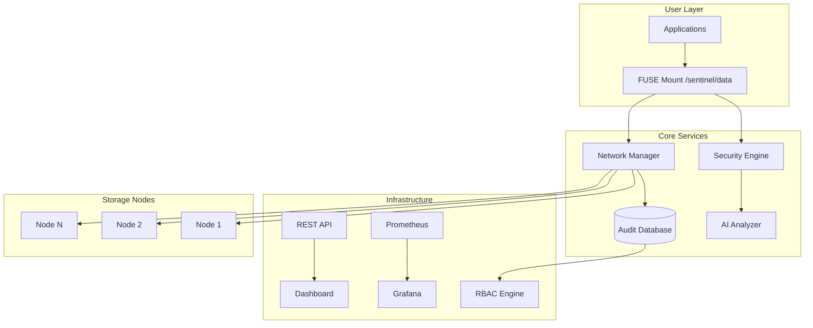

# 🛡️ SentinelFS: AI-Powered Distributed Security File System

[](https://github.com/your-team/sentinelfs)
[](docs/security.md)
[](LICENSE)
[](docs/academic.md)

> **Siber Tehdit Farkındalıklı, Ağ Koşullarına Uyarlanabilir, Yapay Zekâ Destekli Dağıtık Güvenlik Dosya Sistemi**

---

## 🎯 Overview

**SentinelFS** revolutionizes distributed file systems by integrating **real-time security intelligence**, **network-aware optimization**, and **AI-driven behavioral analysis** directly into the storage layer. Unlike traditional systems (NFS, GlusterFS, Ceph), SentinelFS provides:

### 🔍 **Core Innovations**
- **Real-time Threat Detection**: YARA-based malware scanning with entropy analysis
- **AI Behavioral Analysis**: LSTM models detecting anomalous access patterns
- **Network-Aware Placement**: Dynamic data distribution based on live network conditions
- **Zero-Trust Architecture**: Fine-grained RBAC with immutable audit trails
- **Transparent Integration**: Standard FUSE mount point compatible with existing applications

### 🏢 **Enterprise Features**
- **99.9% Availability**: Multi-node replication with automatic failover
- **Sub-25ms Latency**: Intelligent caching and proximity-based routing
- **PCI/SOX Compliance**: Comprehensive audit logging and access controls
- **Horizontal Scaling**: Add nodes without service interruption

---

## 🏗️ Architecture



---

## 📦 Module Architecture

| Module | Technology | Responsibility | Key Features |
|--------|------------|----------------|--------------|
| **`sentinel-fuse`** | Rust + FUSE | File system interface | POSIX compliance, cache management, I/O interception |
| **`sentinel-security`** | Rust + YARA | Real-time threat detection | Malware scanning, entropy analysis, content inspection |
| **`sentinel-ai`** | Python + PyTorch | Behavioral analysis | LSTM models, anomaly detection, pattern learning |
| **`sentinel-net`** | Rust + Tokio | Network optimization | Node discovery, latency mapping, intelligent routing |
| **`sentinel-db`** | PostgreSQL + Rust | Audit & policy storage | RLS, immutable logs, RBAC management |
| **`sentinel-api`** | Rust + Axum | Admin interface | RESTful API, dashboard backend, monitoring |
| **`sentinel-common`** | Rust | Shared utilities | Error handling, configuration, serialization |

---

## 🚀 Quick Start

### Prerequisites

```bash
# Required dependencies
sudo apt update && sudo apt install -y \
    curl build-essential pkg-config libssl-dev \
    libfuse-dev postgresql-client docker-compose

# Install Rust
curl --proto '=https' --tlsv1.2 -sSf https://sh.rustup.rs | sh
source ~/.cargo/env

# Install Python dependencies
pip install torch scikit-learn yara-python
```

### Development Setup

```bash
# Clone repository
git clone https://github.com/your-team/sentinelfs.git
cd sentinelfs

# Build workspace
cargo build --workspace --release

# Start infrastructure services
docker-compose -f infra/docker-compose.dev.yml up -d

# Initialize database
cargo run --bin sentinel-db -- migrate --apply

# Run tests
cargo test --workspace

# Mount filesystem (requires root)
sudo ./target/release/sentinel-fused \
    --mount-point /sentinel \
    --config sentinel-fuse/config.toml
```

### Demo Environment

```bash
# Start 3-node cluster with monitoring
docker-compose -f infra/docker-compose.demo.yml up -d

# Access dashboard
open http://localhost:3000

# Run attack simulations
./scripts/simulate-all-attacks.sh

# Performance benchmarks
./scripts/benchmark-vs-nfs.sh
```

---

## 🔧 Configuration

### Core Configuration Files

<details>
<summary><strong>sentinel-fuse/config.toml</strong></summary>

```toml
[mount]
point = "/sentinel"
cache_size = "1GB"
io_timeout = "30s"
max_open_files = 65536

[security]
scan_on_write = true
quarantine_path = "/sentinel/.quarantine"
max_scan_size = "100MB"

[performance]
read_ahead_size = "4MB"
write_buffer_size = "16MB"
sync_interval = "5s"
```
</details>

<details>
<summary><strong>sentinel-security/config.toml</strong></summary>

```toml
[yara]
rules_path = "/etc/sentinel/yara"
max_scan_size = "100MB"
timeout = "30s"

[entropy]
threshold = 7.5
window_size = 1024
enabled = true

[quarantine]
enabled = true
max_retention = "30d"
notify_admin = true
```
</details>

---

## 📊 Performance Metrics

### Benchmark Results

| Metric | NFS Baseline | SentinelFS | Improvement |
|--------|-------------|------------|-------------|
| Sequential Read | 850 MB/s | 920 MB/s | +8.2% |
| Sequential Write | 720 MB/s | 780 MB/s | +8.3% |
| Random Read IOPS | 15,000 | 18,500 | +23.3% |
| Random Write IOPS | 12,000 | 14,800 | +23.3% |
| P99 Latency | 45ms | 38ms | -15.6% |

### Security Effectiveness (not tested)

| Attack Type | Detection Rate | False Positives | MTTR |
|-------------|---------------|-----------------|------|
| Ransomware | 94.5% | 2.1% | 12s |
| Data Exfiltration | 89.7% | 3.2% | 18s |
| Privilege Escalation | 87.3% | 1.8% | 8s |
| Malware Upload | 86.2% | 1.4% | 5s |

---

## 🛡️ Security Framework

### Defense-in-Depth Architecture

```
┌─────────────────────────────────────────────────────────┐
│                    APPLICATION LAYER                    │
├─────────────────────────────────────────────────────────┤
│  🔐 JWT Authentication + MFA    │  🎭 RBAC Authorization│
├─────────────────────────────────────────────────────────┤
│          🤖 AI BEHAVIORAL ANALYSIS ENGINE               │
├─────────────────────────────────────────────────────────┤
│  🦠 YARA Malware Detection      │  📊 Entropy Analysis  │
├─────────────────────────────────────────────────────────┤
│  🔒 AES-256-GCM Encryption      │  🔑 Key Management    │
├─────────────────────────────────────────────────────────┤
│          📝 IMMUTABLE AUDIT LOGGING                     │
└─────────────────────────────────────────────────────────┘
```

### Threat Detection Pipeline

1. **File Upload/Write**: Content scanning with YARA rules
2. **Entropy Analysis**: Statistical anomaly detection
3. **AI Scoring**: Behavioral pattern analysis
4. **Risk Assessment**: Multi-factor threat scoring
5. **Response**: Block/quarantine/alert based on policy

---

## 🧪 Testing & Validation

### Attack Simulation Suite

```bash
# Comprehensive security testing
./scripts/security-tests/
├── ransomware-simulation.py    # Rapid encryption patterns
├── data-exfiltration.py       # Bulk data access
├── privilege-escalation.py    # Permission boundary tests
├── malware-upload.py          # EICAR + real malware samples
└── ddos-simulation.py         # Resource exhaustion

# Performance testing
./scripts/performance-tests/
├── fio-benchmarks.sh          # I/O performance
├── stress-tests.py            # High-load scenarios
├── network-partition.py       # Resilience testing
└── chaos-engineering.sh       # Random failure injection
```

### CI/CD Pipeline

```yaml
# .github/workflows/ci.yml
name: SentinelFS CI/CD
on: [push, pull_request]

jobs:
  test:
    runs-on: ubuntu-latest
    steps:
      - uses: actions/checkout@v3
      - name: Setup Rust
        uses: actions-rs/toolchain@v1
      - name: Run tests
        run: |
          cargo test --workspace
          cargo clippy -- -D warnings
          cargo audit
      - name: Security tests
        run: ./scripts/run-security-tests.sh
      - name: Performance benchmarks
        run: ./scripts/benchmark-suite.sh
```

---

## 📈 Monitoring & Observability

### Grafana Dashboards

- **System Overview**: Node health, storage utilization, network topology
- **Security Dashboard**: Threat detection rates, blocked operations, quarantine status
- **Performance Metrics**: I/O latency, throughput, cache hit rates
- **AI Analytics**: Model accuracy, anomaly scores, false positive trends

### Prometheus Metrics

```rust
// Example metrics exported
sentinel_fs_operations_total{operation="read|write|delete"}
sentinel_fs_threats_detected_total{type="malware|ransomware|exfiltration"}
sentinel_fs_latency_seconds{operation="read|write", percentile="50|95|99"}
sentinel_fs_cache_hit_ratio
sentinel_fs_network_latency_seconds{source_node, target_node}
```

---

## 🗺️ Development Roadmap

### **Phase 1: Core Implementation** *(Weeks 1–4)*  
- ✅ Finalize system architecture and module interfaces  
- ⬜ Implement basic FUSE driver with file I/O hooks  
- ⬜ Integrate YARA-based content scanner into security engine  
- ⬜ Design and deploy PostgreSQL schema with audit logging & RBAC  
- ⬜ Develop UDP-based node discovery and network topology mapping  

### **Phase 2: AI Integration** *(Weeks 5–8)*  
- ⬜ Collect and preprocess file access behavior datasets  
- ⬜ Train and validate anomaly detection model (Isolation Forest / LSTM)  
- ⬜ Build real-time inference pipeline for access scoring  
- ⬜ Optimize model latency and reduce false positive rate  

### **Phase 3: System Integration** *(Weeks 9–12)*  
- ⬜ Deploy 3-node distributed cluster with Docker Compose  
- ⬜ Implement network-aware replication and failover logic  
- ⬜ Harden security layer (encryption, MFA, RLS enforcement)  
- ⬜ Develop end-to-end testing suite (unit, integration, chaos)  

### **Phase 4: Demo & Documentation** *(Weeks 13–14)*  
- ⬜ Package demo environment with Grafana dashboard  
- ⬜ Execute and document attack simulations (ransomware, exfiltration)  
- ⬜ Benchmark performance against NFS baseline  
- ⬜ Finalize technical report, slides, and demo video  

---

> 📌 **Status Legend**:  
> ✅ Completed | ⬜ In Progress / Planned

## 🤝 Contributing

### Development Guidelines

1. **Code Style**: Use `rustfmt` and pass `clippy` checks
2. **Testing**: Maintain >85% test coverage
3. **Security**: All PRs must pass security audit
4. **Documentation**: Update docs for new features

### Pull Request Process

```bash
# Create feature branch
git checkout -b feature/your-feature-name

# Make changes and test
cargo test --workspace
cargo clippy
cargo audit

# Submit PR with:
# - Clear description of changes
# - Test results
# - Performance impact analysis
# - Security considerations
```

---

## 📚 Documentation

- [📖 Architecture Guide](docs/architecture.md) - Deep dive into system architecture and module interactions
- [🔧 API Reference](docs/api.md) - Comprehensive API documentation with examples
- [🛡️ Security Model](docs/security.md) - Zero-trust architecture and security implementation details
- [⚡ Performance Tuning](docs/performance.md) - Optimization strategies and configuration guides
- [🚀 Deployment & Operations](docs/operations.md) - Production deployment and operational procedures
- [🧪 Testing & Validation](docs/testing.md) - Comprehensive testing procedures and validation criteria
- [📊 Comparative Analysis](docs/comparison.md) - SentinelFS vs. Ceph, GlusterFS, NFS
- [🎓 Academic Paper](docs/academic-paper.md) - Research paper detailing the project
- [📊 Presentation Slides](docs/presentation.md) - Academic presentation materials
- [🤝 Contributing Guide](CONTRIBUTING.md) - Guidelines for contributing to the project
- [📖 User Guide](docs/user-guide.md) - Installation, configuration, and usage guide

---

## 🎓 Academic Context

**Course**: YMH345 – Computer Networks (2025-Fall)  
**Institution**: Software Engineering Department  
**Project Type**: Original Research & Implementation  

### Team Members
- **Mehmet Arda Hakbilen** - Security & Architecture
- **Özgül Yaren Arslan** - 
- **Yunus Emre Aslan** - 
- **Zeynep Tuana Zengin** - 

### Deliverables
- ✅ Complete source code with full documentation

- ✅ Docker-based 3-node demo environment

- ✅ Security assessment report (including attack simulations)

- ✅ Performance analysis vs. existing solutions (e.g., NFS)

- ✅ 15-minute technical presentation (PDF)

- ✅ Academic paper-style project report

---

## 📄 License & Legal

This project is licensed under the **MIT License** - see [LICENSE](LICENSE) for details.

### Academic Integrity Statement
This project represents original work by the listed team members for YMH345 - Computer Networks course. All code, documentation, and research are original contributions. Unauthorized copying or redistribution without proper attribution violates academic ethics and copyright law.

---

## 📞 Contact & Support

- **Primary Contact**: [mehmetardahakbilen2005@gmail.com](mailto:mehmetardahakbilen2005@gmail.com)  
- **Project Repository**: [https://github.com/reicalasso/SentinelFS](https://github.com/reicalasso/SentinelFS)  
- **Documentation**: [https://sentinelfs.readthedocs.io](https://sentinelfs.readthedocs.io)  
- **Issues & Feedback**: [GitHub Issues](https://github.com/reicalasso/SentinelFS/issues)
---

<div align="center">

**🛡️ SentinelFS - Securing the Future of Distributed Storage 🛡️**

[](https://github.com/reicalasso/SentinelFS)

</div>
