# SentinelFS Database ER Diagram

## Overview
SentinelFS veritabanı, dağıtılmış dosya senkronizasyonu, versiyon kontrolü, çakışma çözümü, tehdit algılama ve P2P ağ iletişimi yetenekleriyle tasarlanmıştır. FalconStore eklentisi aracılığıyla SQLite tabanlı bir depolama sistemi kullanır.

**Şema Versiyonu:** 9  
**Veritabanı Motoru:** SQLite3 (WAL modu, Foreign Keys etkin)

## Tam ER Diyagramı

```mermaid
erDiagram
    %% ===============================
    %% LOOKUP TABLES (Referans Tablolar)
    %% ===============================
    
    op_types {
        int id PK "1-7"
        text name UK "create, update, delete, read, write, rename, move"
    }
    
    status_types {
        int id PK "1-7"
        text name UK "active, pending, syncing, completed, failed, offline, paused"
    }
    
    threat_types {
        int id PK "0-10"
        text name UK "Zer0 tehdit tipleri"
    }
    
    threat_levels {
        int id PK "0-5"
        text name UK "NONE, INFO, LOW, MEDIUM, HIGH, CRITICAL"
    }
    
    %% ===============================
    %% CORE TABLES (Ana Tablolar)
    %% ===============================
    
    files {
        int id PK "AUTOINCREMENT"
        text path UK "NOT NULL"
        text hash "DEFAULT ''"
        int size "NOT NULL DEFAULT 0"
        int modified "NOT NULL DEFAULT 0"
        int synced "NOT NULL DEFAULT 0"
        int version "NOT NULL DEFAULT 1"
        int created_at "DEFAULT CURRENT_TIMESTAMP"
    }
    
    peers {
        int id PK "AUTOINCREMENT"
        text peer_id UK "NOT NULL"
        text name "NOT NULL"
        text address "NOT NULL DEFAULT ''"
        int port "NOT NULL DEFAULT 0"
        text public_key "nullable"
        int status_id FK "NOT NULL DEFAULT 6"
        int last_seen "NOT NULL DEFAULT 0"
        int latency "NOT NULL DEFAULT 0"
    }
    
    conflicts {
        int id PK "AUTOINCREMENT"
        int file_id FK "NOT NULL"
        text local_hash "NOT NULL DEFAULT ''"
        text remote_hash "NOT NULL DEFAULT ''"
        int local_size "NOT NULL DEFAULT 0"
        int remote_size "NOT NULL DEFAULT 0"
        int local_timestamp "NOT NULL DEFAULT 0"
        int remote_timestamp "NOT NULL DEFAULT 0"
        text remote_peer_id "NOT NULL DEFAULT ''"
        int detected_at "DEFAULT CURRENT_TIMESTAMP"
        int resolved "NOT NULL DEFAULT 0"
        text resolution "NOT NULL DEFAULT ''"
        text strategy "NOT NULL DEFAULT 'manual'"
    }
    
    watched_folders {
        int id PK "AUTOINCREMENT"
        text path UK "NOT NULL"
        int added_at "NOT NULL DEFAULT CURRENT_TIMESTAMP"
        int status_id FK "NOT NULL DEFAULT 1"
    }
    
    %% ===============================
    %% THREAT DETECTION (Tehdit Algılama)
    %% ===============================
    
    detected_threats {
        int id PK "AUTOINCREMENT"
        int file_id FK "nullable"
        text file_path "NOT NULL"
        int threat_type_id FK "NOT NULL"
        int threat_level_id FK "NOT NULL"
        real threat_score "NOT NULL"
        text detected_at "NOT NULL"
        real entropy "nullable"
        int file_size "NOT NULL"
        text hash "nullable"
        text quarantine_path "nullable"
        text ml_model_used "nullable"
        text additional_info "nullable"
        int marked_safe "DEFAULT 0"
    }
    
    %% ===============================
    %% VERSION CONTROL (Versiyon Kontrolü)
    %% ===============================
    
    file_versions {
        int id PK "AUTOINCREMENT"
        int file_id FK "NOT NULL"
        int version "NOT NULL"
        text hash "NOT NULL"
        int size "NOT NULL"
        int created_at "DEFAULT CURRENT_TIMESTAMP"
        text created_by "nullable"
        text delta_path "nullable"
    }
    
    %% ===============================
    %% SYNC QUEUE (Senkronizasyon Kuyruğu)
    %% ===============================
    
    sync_queue {
        int id PK "AUTOINCREMENT"
        int file_id FK "NOT NULL"
        text peer_id "NOT NULL"
        int op_type_id FK "NOT NULL"
        int status_id FK "DEFAULT 2"
        int priority "DEFAULT 5"
        int created_at "DEFAULT CURRENT_TIMESTAMP"
        int started_at "nullable"
        int completed_at "nullable"
        int retry_count "DEFAULT 0"
        text error_message "nullable"
    }
    
    %% ===============================
    %% ACTIVITY LOG (Aktivite Günlüğü)
    %% ===============================
    
    activity_log {
        int id PK "AUTOINCREMENT"
        int file_id FK "nullable"
        int op_type_id FK "NOT NULL"
        int timestamp "DEFAULT CURRENT_TIMESTAMP"
        text details "nullable"
        text peer_id "nullable"
    }
    
    %% ===============================
    %% UTILITY TABLES (Yardımcı Tablolar)
    %% ===============================
    
    ignore_patterns {
        int id PK "AUTOINCREMENT"
        text pattern UK "NOT NULL"
        int created_at "DEFAULT CURRENT_TIMESTAMP"
    }
    
    blocked_peers {
        text peer_id PK
        text blocked_at "DEFAULT CURRENT_TIMESTAMP"
    }
    
    config {
        text key PK
        text value "nullable"
    }
    
    transfer_history {
        int id PK "AUTOINCREMENT"
        text file_path "nullable"
        text peer_id "nullable"
        text direction "upload/download"
        int bytes "nullable"
        int success "0/1"
        int timestamp "DEFAULT CURRENT_TIMESTAMP"
    }
    
    schema_migrations {
        int version PK
        text name "NOT NULL"
        int applied_at "DEFAULT CURRENT_TIMESTAMP"
    }
    
    %% ===============================
    %% RELATIONSHIPS (İlişkiler)
    %% ===============================
    
    %% Core relationships
    files ||--o{ conflicts : "has conflicts"
    files ||--o{ detected_threats : "scanned for"
    files ||--o{ file_versions : "has versions"
    files ||--o{ sync_queue : "queued for sync"
    files ||--o{ activity_log : "activity logged"
    
    %% Lookup table relationships
    status_types ||--o{ peers : "status"
    status_types ||--o{ watched_folders : "status"
    status_types ||--o{ sync_queue : "status"
    op_types ||--o{ sync_queue : "operation"
    op_types ||--o{ activity_log : "operation"
    threat_types ||--o{ detected_threats : "type"
    threat_levels ||--o{ detected_threats : "level"
```



## Tablo Detayları

### Referans Tablolar (Lookup Tables)

#### `op_types`
Dosya işlem türlerini tanımlar.

| ID | Name | Açıklama |
|----|------|----------|
| 1 | create | Dosya oluşturma |
| 2 | update | Dosya güncelleme |
| 3 | delete | Dosya silme |
| 4 | read | Dosya okuma |
| 5 | write | Dosya yazma |
| 6 | rename | Dosya yeniden adlandırma |
| 7 | move | Dosya taşıma |

#### `status_types`
İşlem ve varlık durumlarını tanımlar.

| ID | Name | Açıklama |
|----|------|----------|
| 1 | active | Aktif |
| 2 | pending | Beklemede |
| 3 | syncing | Senkronize ediliyor |
| 4 | completed | Tamamlandı |
| 5 | failed | Başarısız |
| 6 | offline | Çevrimdışı |
| 7 | paused | Duraklatıldı |

#### `threat_types`
Zer0 uyumlu tehdit tiplerini tanımlar.

| ID | Name | Açıklama |
|----|------|----------|
| 0 | UNKNOWN | Bilinmeyen tehdit |
| 1 | RANSOMWARE_PATTERN | Fidye yazılımı kalıbı |
| 2 | HIGH_ENTROPY_TEXT | Yüksek entropi/şifreli metin |
| 3 | HIDDEN_EXECUTABLE | Gizlenmiş çalıştırılabilir dosya |
| 4 | EXTENSION_MISMATCH | Uzantı uyumsuzluğu |
| 5 | DOUBLE_EXTENSION | Çift uzantı (örn: file.pdf.exe) |
| 6 | MASS_MODIFICATION | Toplu dosya değişikliği |
| 7 | SCRIPT_IN_DATA | Veri dosyasında gömülü script |
| 8 | ANOMALOUS_BEHAVIOR | Anormal davranış |
| 9 | KNOWN_MALWARE_HASH | Bilinen zararlı yazılım hash'i |
| 10 | SUSPICIOUS_RENAME | Şüpheli yeniden adlandırma |

#### `threat_levels`
Tehdit seviyelerini tanımlar.

| ID | Name | Açıklama |
|----|------|----------|
| 0 | NONE | Tehdit yok |
| 1 | INFO | Bilgilendirme |
| 2 | LOW | Düşük risk |
| 3 | MEDIUM | Orta risk |
| 4 | HIGH | Yüksek risk |
| 5 | CRITICAL | Kritik risk |

---

### Ana Tablolar (Core Tables)

#### `files`
Dağıtılmış dosya sistemindeki tüm dosyaların metadata bilgilerini saklar.

| Sütun | Tip | Açıklama | Kısıtlamalar |
|-------|-----|----------|--------------|
| id | INTEGER | Primary key | AUTOINCREMENT |
| path | TEXT | Tam dosya yolu | UNIQUE, NOT NULL |
| hash | TEXT | Dosya içerik hash'i | NOT NULL DEFAULT '' |
| size | INTEGER | Dosya boyutu (bytes) | NOT NULL DEFAULT 0 |
| modified | INTEGER | Son değişiklik timestamp | NOT NULL DEFAULT 0 |
| synced | INTEGER | Senkronize durumu (0/1) | NOT NULL DEFAULT 0 |
| version | INTEGER | Dosya versiyon numarası | NOT NULL DEFAULT 1 |
| created_at | INTEGER | Kayıt oluşturma zamanı | DEFAULT (strftime('%s', 'now')) |

**İndeksler:**
- `idx_files_path` - path üzerinde
- `idx_files_hash` - hash üzerinde
- `idx_files_synced` - synced üzerinde

#### `peers`
P2P iletişimi için ağ peer bilgilerini yönetir.

| Sütun | Tip | Açıklama | Kısıtlamalar |
|-------|-----|----------|--------------|
| id | INTEGER | Primary key | AUTOINCREMENT |
| peer_id | TEXT | Benzersiz peer kimliği | UNIQUE, NOT NULL |
| name | TEXT | Peer adı | NOT NULL |
| address | TEXT | IP adresi | NOT NULL DEFAULT '' |
| port | INTEGER | Port numarası | NOT NULL DEFAULT 0 |
| public_key | TEXT | Public key (şifreleme için) | nullable |
| status_id | INTEGER | Durum referansı | FK → status_types(id), NOT NULL DEFAULT 6 |
| last_seen | INTEGER | Son görülme zamanı | NOT NULL DEFAULT 0 |
| latency | INTEGER | Gecikme (ms) | NOT NULL DEFAULT 0 |

**İndeksler:**
- `idx_peers_status` - status_id üzerinde

#### `conflicts`
Dosya çakışmalarını ve çözüm durumlarını takip eder.

| Sütun | Tip | Açıklama | Kısıtlamalar |
|-------|-----|----------|--------------|
| id | INTEGER | Primary key | AUTOINCREMENT |
| file_id | INTEGER | Dosya referansı | FK → files(id) ON DELETE CASCADE, NOT NULL |
| local_hash | TEXT | Yerel dosya hash'i | NOT NULL DEFAULT '' |
| remote_hash | TEXT | Uzak dosya hash'i | NOT NULL DEFAULT '' |
| local_size | INTEGER | Yerel dosya boyutu | NOT NULL DEFAULT 0 |
| remote_size | INTEGER | Uzak dosya boyutu | NOT NULL DEFAULT 0 |
| local_timestamp | INTEGER | Yerel değişiklik zamanı | NOT NULL DEFAULT 0 |
| remote_timestamp | INTEGER | Uzak değişiklik zamanı | NOT NULL DEFAULT 0 |
| remote_peer_id | TEXT | Uzak peer ID'si | NOT NULL DEFAULT '' |
| detected_at | INTEGER | Çakışma tespit zamanı | DEFAULT (strftime('%s', 'now')) |
| resolved | INTEGER | Çözüldü mü (0/1) | NOT NULL DEFAULT 0 |
| resolution | TEXT | Çözüm detayı | NOT NULL DEFAULT '' |
| strategy | TEXT | Çözüm stratejisi | NOT NULL DEFAULT 'manual' |

**İndeksler:**
- `idx_conflicts_file` - file_id üzerinde
- `idx_conflicts_resolved` - resolved üzerinde

#### `watched_folders`
İzlenen klasörleri yönetir.

| Sütun | Tip | Açıklama | Kısıtlamalar |
|-------|-----|----------|--------------|
| id | INTEGER | Primary key | AUTOINCREMENT |
| path | TEXT | Klasör yolu | UNIQUE, NOT NULL |
| added_at | INTEGER | Ekleme zamanı | NOT NULL DEFAULT (strftime('%s', 'now')) |
| status_id | INTEGER | Durum referansı | FK → status_types(id), NOT NULL DEFAULT 1 |

---

### Tehdit Algılama Tabloları

#### `detected_threats`
Zer0 güvenlik motoru tarafından tespit edilen tehditleri saklar.

| Sütun | Tip | Açıklama | Kısıtlamalar |
|-------|-----|----------|--------------|
| id | INTEGER | Primary key | AUTOINCREMENT |
| file_id | INTEGER | Dosya referansı | FK → files(id) ON DELETE CASCADE, nullable |
| file_path | TEXT | Dosya yolu | NOT NULL |
| threat_type_id | INTEGER | Tehdit tipi | FK → threat_types(id), NOT NULL |
| threat_level_id | INTEGER | Tehdit seviyesi | FK → threat_levels(id), NOT NULL |
| threat_score | REAL | Tehdit skoru (0.0-1.0) | NOT NULL |
| detected_at | TEXT | Tespit zamanı (ISO format) | NOT NULL |
| entropy | REAL | Dosya entropi değeri | nullable |
| file_size | INTEGER | Dosya boyutu | NOT NULL |
| hash | TEXT | Dosya hash'i | nullable |
| quarantine_path | TEXT | Karantina yolu | nullable |
| ml_model_used | TEXT | Kullanılan ML modeli | nullable |
| additional_info | TEXT | Ek bilgiler (JSON) | nullable |
| marked_safe | INTEGER | Güvenli işaretlendi (0/1) | DEFAULT 0 |

**İndeksler:**
- `idx_detected_threats_file` - file_id üzerinde
- `idx_detected_threats_level` - threat_level_id üzerinde
- `idx_detected_threats_detected` - detected_at üzerinde
- `idx_detected_threats_path` - file_path üzerinde

---

### Versiyon Kontrolü Tabloları

#### `file_versions`
Dosya versiyonlarını ve delta bilgilerini saklar.

| Sütun | Tip | Açıklama | Kısıtlamalar |
|-------|-----|----------|--------------|
| id | INTEGER | Primary key | AUTOINCREMENT |
| file_id | INTEGER | Dosya referansı | FK → files(id) ON DELETE CASCADE, NOT NULL |
| version | INTEGER | Versiyon numarası | NOT NULL |
| hash | TEXT | Versiyon hash'i | NOT NULL |
| size | INTEGER | Versiyon boyutu | NOT NULL |
| created_at | INTEGER | Oluşturma zamanı | DEFAULT (strftime('%s', 'now')) |
| created_by | TEXT | Oluşturan peer ID | nullable |
| delta_path | TEXT | Delta dosyası yolu | nullable |

**İndeksler:**
- `idx_file_versions_file` - file_id üzerinde
- `idx_file_versions_version` - version üzerinde

---

### Senkronizasyon Tabloları

#### `sync_queue`
Senkronizasyon kuyruğunu yönetir.

| Sütun | Tip | Açıklama | Kısıtlamalar |
|-------|-----|----------|--------------|
| id | INTEGER | Primary key | AUTOINCREMENT |
| file_id | INTEGER | Dosya referansı | FK → files(id) ON DELETE CASCADE, NOT NULL |
| peer_id | TEXT | Hedef peer ID'si | NOT NULL |
| op_type_id | INTEGER | İşlem tipi | FK → op_types(id), NOT NULL |
| status_id | INTEGER | Kuyruk durumu | FK → status_types(id), DEFAULT 2 |
| priority | INTEGER | Öncelik (1-10) | DEFAULT 5 |
| created_at | INTEGER | Kuyruğa ekleme zamanı | DEFAULT (strftime('%s', 'now')) |
| started_at | INTEGER | İşlem başlama zamanı | nullable |
| completed_at | INTEGER | İşlem tamamlanma zamanı | nullable |
| retry_count | INTEGER | Tekrar deneme sayısı | DEFAULT 0 |
| error_message | TEXT | Hata mesajı | nullable |

**İndeksler:**
- `idx_sync_queue_status` - status_id üzerinde
- `idx_sync_queue_file` - file_id üzerinde
- `idx_sync_queue_priority` - priority üzerinde

---

### Aktivite ve Log Tabloları

#### `activity_log`
Dosya aktivitelerini kaydeder.

| Sütun | Tip | Açıklama | Kısıtlamalar |
|-------|-----|----------|--------------|
| id | INTEGER | Primary key | AUTOINCREMENT |
| file_id | INTEGER | Dosya referansı | FK → files(id) ON DELETE SET NULL, nullable |
| op_type_id | INTEGER | İşlem tipi | FK → op_types(id), NOT NULL |
| timestamp | INTEGER | İşlem zamanı | DEFAULT (strftime('%s', 'now')) |
| details | TEXT | İşlem detayları (JSON) | nullable |
| peer_id | TEXT | İlgili peer ID | nullable |

**İndeksler:**
- `idx_activity_log_file` - file_id üzerinde
- `idx_activity_log_timestamp` - timestamp üzerinde
- `idx_activity_log_op` - op_type_id üzerinde

#### `transfer_history`
Dosya transfer geçmişini saklar.

| Sütun | Tip | Açıklama | Kısıtlamalar |
|-------|-----|----------|--------------|
| id | INTEGER | Primary key | AUTOINCREMENT |
| file_path | TEXT | Transfer edilen dosya yolu | nullable |
| peer_id | TEXT | Transfer yapılan peer | nullable |
| direction | TEXT | Transfer yönü | 'upload' veya 'download' |
| bytes | INTEGER | Transfer edilen byte sayısı | nullable |
| success | INTEGER | Başarılı mı (0/1) | nullable |
| timestamp | INTEGER | Transfer zamanı | DEFAULT (strftime('%s', 'now')) |

---

### Yardımcı Tablolar

#### `ignore_patterns`
Senkronizasyondan hariç tutulacak dosya kalıplarını saklar.

| Sütun | Tip | Açıklama | Kısıtlamalar |
|-------|-----|----------|--------------|
| id | INTEGER | Primary key | AUTOINCREMENT |
| pattern | TEXT | Glob pattern (örn: *.tmp) | UNIQUE, NOT NULL |
| created_at | INTEGER | Ekleme zamanı | DEFAULT (strftime('%s', 'now')) |

#### `blocked_peers`
Engellenmiş peer'ları saklar.

| Sütun | Tip | Açıklama | Kısıtlamalar |
|-------|-----|----------|--------------|
| peer_id | TEXT | Engellenen peer ID | PRIMARY KEY |
| blocked_at | TEXT | Engelleme zamanı | DEFAULT CURRENT_TIMESTAMP |

#### `config`
Uygulama konfigürasyon değerlerini saklar.

| Sütun | Tip | Açıklama | Kısıtlamalar |
|-------|-----|----------|--------------|
| key | TEXT | Konfigürasyon anahtarı | PRIMARY KEY |
| value | TEXT | Konfigürasyon değeri | nullable |

#### `schema_migrations`
Veritabanı şema migrasyon geçmişini takip eder.

| Sütun | Tip | Açıklama | Kısıtlamalar |
|-------|-----|----------|--------------|
| version | INTEGER | Migrasyon versiyonu | PRIMARY KEY |
| name | TEXT | Migrasyon adı | NOT NULL |
| applied_at | INTEGER | Uygulama zamanı | DEFAULT (strftime('%s', 'now')) |

---

## İlişki Şeması

```
┌─────────────────┐     ┌─────────────────┐     ┌─────────────────┐
│   op_types      │     │  status_types   │     │  threat_types   │
│   (7 kayıt)     │     │   (7 kayıt)     │     │   (11 kayıt)    │
└────────┬────────┘     └────────┬────────┘     └────────┬────────┘
         │                       │                       │
         │              ┌────────┼────────┐              │
         │              │        │        │              │
         ▼              ▼        ▼        ▼              ▼
┌─────────────────┐  ┌──────┐ ┌──────┐ ┌──────────┐  ┌────────────┐
│   sync_queue    │  │peers │ │watch │ │sync_queue│  │  threat    │
│   activity_log  │  │      │ │folder│ │          │  │  levels    │
└────────┬────────┘  └──┬───┘ └──────┘ └──────────┘  └─────┬──────┘
         │              │                                   │
         │              │        ┌─────────────┐            │
         │              │        │   files     │            │
         │              │        │ (ana tablo) │            │
         │              │        └──────┬──────┘            │
         │              │               │                   │
         └──────────────┴───────────────┼───────────────────┘
                                        │
              ┌───────────┬─────────────┼─────────────┬────────────┐
              │           │             │             │            │
              ▼           ▼             ▼             ▼            ▼
        ┌──────────┐ ┌──────────┐ ┌──────────┐ ┌──────────┐ ┌──────────┐
        │conflicts │ │file_vers │ │sync_queue│ │activity  │ │detected  │
        │          │ │ions      │ │          │ │_log      │ │_threats  │
        └──────────┘ └──────────┘ └──────────┘ └──────────┘ └──────────┘
```

---

## GUI Veri Tipleri Eşlemesi

### TypeScript Interface → Veritabanı Tablosu

| TypeScript Interface | Veritabanı Tablosu | Açıklama |
|---------------------|-------------------|----------|
| `SyncFile` | `files` | Senkronize dosya bilgileri |
| `Peer` | `peers` + `status_types` | Peer bağlantı bilgileri |
| `Conflict` / `ConflictDetail` | `conflicts` + `files` | Çakışma detayları |
| `FileVersion` | `file_versions` | Dosya versiyon geçmişi |
| `DetectedThreat` | `detected_threats` + `threat_types` + `threat_levels` | Tehdit bilgileri |
| `ActivityItem` | `activity_log` + `op_types` | Aktivite günlüğü |
| `TransferHistoryItem` | `transfer_history` | Transfer geçmişi |

### Tehdit Tipi Eşlemesi (GUI ↔ DB)

| GUI ThreatType | DB threat_type_id | Açıklama |
|----------------|-------------------|----------|
| UNKNOWN | 0 | Bilinmeyen |
| RANSOMWARE_PATTERN | 1 | Fidye yazılımı |
| HIGH_ENTROPY_TEXT | 2 | Yüksek entropi |
| HIDDEN_EXECUTABLE | 3 | Gizli çalıştırılabilir |
| EXTENSION_MISMATCH | 4 | Uzantı uyumsuzluğu |
| DOUBLE_EXTENSION | 5 | Çift uzantı |
| MASS_MODIFICATION | 6 | Toplu değişiklik |
| SCRIPT_IN_DATA | 7 | Gömülü script |
| ANOMALOUS_BEHAVIOR | 8 | Anormal davranış |
| KNOWN_MALWARE_HASH | 9 | Bilinen zararlı hash |
| SUSPICIOUS_RENAME | 10 | Şüpheli yeniden adlandırma |

### Tehdit Seviyesi Eşlemesi (GUI ↔ DB)

| GUI ThreatLevel | DB threat_level_id | Renk Kodu |
|-----------------|-------------------|-----------|
| NONE | 0 | - |
| INFO | 1 | Mavi |
| LOW | 2 | Yeşil |
| MEDIUM | 3 | Sarı |
| HIGH | 4 | Turuncu |
| CRITICAL | 5 | Kırmızı |

---

## Migrasyon Geçmişi

| Versiyon | Ad | Açıklama |
|----------|-----|----------|
| 1 | Initial schema | Temel tablolar: files, peers, conflicts, watched_folders, lookup tables |
| 2 | Threat detection | detected_threats tablosu, Zer0 uyumlu tehdit tipleri |
| 3 | File versioning | file_versions tablosu |
| 4 | Sync queue | sync_queue tablosu |
| 5 | Activity log | activity_log tablosu |
| 6 | Ignore patterns | ignore_patterns tablosu |
| 7 | Legacy schema compatibility | files tablosu için geriye uyumluluk düzeltmeleri |
| 8 | Standardize peers table | peers tablosu NOT NULL kısıtlamaları |
| 9 | Standardize all tables | files, conflicts, watched_folders standartlaştırma |

---

## Örnek Sorgular

### Aktif Tehditleri Listele
```sql
SELECT 
    dt.id,
    dt.file_path,
    tt.name as threat_type,
    tl.name as threat_level,
    dt.threat_score,
    dt.entropy,
    datetime(dt.detected_at) as detected_time
FROM detected_threats dt
JOIN threat_types tt ON dt.threat_type_id = tt.id
JOIN threat_levels tl ON dt.threat_level_id = tl.id
WHERE dt.marked_safe = 0
ORDER BY dt.threat_score DESC;
```

### Peer Durumları
```sql
SELECT 
    p.peer_id,
    p.name,
    p.address,
    p.port,
    st.name as status,
    p.latency,
    datetime(p.last_seen, 'unixepoch') as last_seen
FROM peers p
JOIN status_types st ON p.status_id = st.id
ORDER BY p.latency ASC;
```

### Dosya Versiyon Geçmişi
```sql
SELECT 
    f.path,
    fv.version,
    fv.hash,
    fv.size,
    datetime(fv.created_at, 'unixepoch') as created,
    fv.created_by
FROM file_versions fv
JOIN files f ON fv.file_id = f.id
WHERE f.path = '/path/to/file'
ORDER BY fv.version DESC;
```

### Çözülmemiş Çakışmalar
```sql
SELECT 
    f.path,
    c.local_hash,
    c.remote_hash,
    c.remote_peer_id,
    c.strategy,
    datetime(c.detected_at, 'unixepoch') as detected
FROM conflicts c
JOIN files f ON c.file_id = f.id
WHERE c.resolved = 0
ORDER BY c.detected_at DESC;
```

---

## Notlar

1. **Tüm timestamp'ler Unix epoch formatında** (saniye cinsinden) saklanır, `detected_threats.detected_at` hariç (ISO format string).

2. **Foreign key kısıtlamaları** etkin durumdadır (`PRAGMA foreign_keys=ON`).

3. **WAL modu** varsayılan olarak etkindir, performans için `PRAGMA synchronous=NORMAL` kullanılır.

4. **Cache sistemi** LRU algoritması ile file ve peer sorguları için kullanılır.

5. **Lookup tablolar** uygulama başlangıcında otomatik olarak doldurulur ve değiştirilmemelidir.
| id | INTEGER | Primary key | AUTO_INCREMENT |
| peer_id | TEXT | Unique peer identifier | UNIQUE, NOT NULL |
| endpoint | TEXT | Network endpoint | |
| last_seen | INTEGER | Last contact timestamp | DEFAULT (strftime('%s', 'now')) |
| latency | INTEGER | Network latency in ms | DEFAULT 0 |
| status | TEXT | Peer status | DEFAULT 'offline' |
| trust_level | INTEGER | Trust score | DEFAULT 0 |
| created_at | INTEGER | First seen timestamp | DEFAULT (strftime('%s', 'now')) |
| updated_at | INTEGER | Last update timestamp | DEFAULT (strftime('%s', 'now')) |

#### `sync_state`
Tracks synchronization status for each file-device pair.

| Column | Type | Description | Constraints |
|--------|------|-------------|-------------|
| id | INTEGER | Primary key | AUTO_INCREMENT |
| file_id | INTEGER | Reference to files | NOT NULL, FK → files(id) |
| device_id | INTEGER | Reference to device | NOT NULL, FK → device(id) |
| last_sync_hash | TEXT | Hash of last synced version | |
| last_sync_time | INTEGER | Last successful sync | DEFAULT 0 |
| sync_status | TEXT | Current sync status | DEFAULT 'pending' |
| conflict_resolution | TEXT | Conflict resolution strategy | |
| priority | INTEGER | Sync priority | DEFAULT 0 (v5) |
| batch_id | TEXT | Batch identifier | (v5) |
| created_at | INTEGER | Record creation | DEFAULT (strftime('%s', 'now')) |
| updated_at | INTEGER | Last update | DEFAULT (strftime('%s', 'now')) |

### Version Control Tables (v6+)

#### `file_versions`
Stores version history for files.

| Column | Type | Description | Constraints |
|--------|------|-------------|-------------|
| id | INTEGER | Primary key | AUTO_INCREMENT |
| file_id | INTEGER | Reference to files | NOT NULL, FK → files(id) |
| device_id | INTEGER | Reference to device | NOT NULL, FK → device(id) |
| version | INTEGER | Version number | NOT NULL |
| hash | TEXT | Content hash | NOT NULL |
| size | INTEGER | File size | DEFAULT 0 |
| modified_time | INTEGER | Modification timestamp | DEFAULT 0 |
| content | BLOB | File content (optional) | |
| is_deleted | BOOLEAN | Deletion marker | DEFAULT 0 |
| created_at | INTEGER | Version creation | DEFAULT (strftime('%s', 'now')) |

#### `conflicts`
Tracks file conflicts between devices.

| Column | Type | Description | Constraints |
|--------|------|-------------|-------------|
| id | INTEGER | Primary key | AUTO_INCREMENT |
| file_id | INTEGER | Reference to files | NOT NULL, FK → files(id) |
| device_id | INTEGER | Reference to device | NOT NULL, FK → device(id) |
| conflict_type | INTEGER | Type of conflict | NOT NULL (1=CONTENT, 2=METADATA, 3=DELETION, 4=RENAME) |
| local_version | INTEGER | Local version number | |
| remote_version | INTEGER | Remote version number | |
| local_hash | TEXT | Local content hash | |
| remote_hash | TEXT | Remote content hash | |
| status | TEXT | Conflict status | DEFAULT 'pending' |
| resolution_strategy | TEXT | How to resolve | |
| resolved_at | INTEGER | Resolution timestamp | |
| created_at | INTEGER | Conflict detection | DEFAULT (strftime('%s', 'now')) |
| updated_at | INTEGER | Last update | DEFAULT (strftime('%s', 'now')) |

#### `merge_results`
Stores results of 3-way merge operations.

| Column | Type | Description | Constraints |
|--------|------|-------------|-------------|
| id | INTEGER | Primary key | AUTO_INCREMENT |
| conflict_id | INTEGER | Reference to conflicts | NOT NULL, FK → conflicts(id) |
| base_version | INTEGER | Base version for merge | NOT NULL |
| merged_hash | TEXT | Merged content hash | NOT NULL |
| merge_data | BLOB | Merge metadata | |
| conflicts_remaining | INTEGER | Unresolved conflicts | DEFAULT 0 |
| created_at | INTEGER | Merge timestamp | DEFAULT (strftime('%s', 'now')) |

### System Tables

#### `schema_version`
Tracks database schema version (core system).

| Column | Type | Description | Constraints |
|--------|------|-------------|-------------|
| version | INTEGER | Schema version | PRIMARY KEY |
| description | TEXT | Version description | |

#### `schema_migrations`
Tracks migration history (Falcon plugin).

| Column | Type | Description | Constraints |
|--------|------|-------------|-------------|
| version | INTEGER | Migration version | PRIMARY KEY |
| name | TEXT | Migration name | NOT NULL |
| applied_at | INTEGER | Application timestamp | DEFAULT (strftime('%s', 'now')) |

## Database Indexes

### Performance Indexes
- `idx_files_path` ON files(path)
- `idx_files_hash` ON files(hash)
- `idx_files_modified` ON files(modified_time)
- `idx_operations_file_id` ON operations(file_id)
- `idx_operations_device_id` ON operations(device_id)
- `idx_operations_status` ON operations(status)
- `idx_operations_timestamp` ON operations(timestamp)
- `idx_operations_file_status` ON operations(file_id, status) (v2+)
- `idx_operations_device_timestamp` ON operations(device_id, timestamp) (v2+)
- `idx_peers_peer_id` ON peers(peer_id)
- `idx_peers_status` ON peers(status)
- `idx_sync_state_file_device` ON sync_state(file_id, device_id)
- `idx_sync_state_status` ON sync_state(sync_status) (v2+)
- `idx_file_versions_file_id` ON file_versions(file_id) (v6+)
- `idx_file_versions_device_id` ON file_versions(device_id) (v6+)
- `idx_file_versions_hash` ON file_versions(hash) (v6+)
- `idx_conflicts_file_id` ON conflicts(file_id) (v6+)
- `idx_conflicts_status` ON conflicts(status) (v6+)
- `idx_conflicts_created_at` ON conflicts(created_at) (v6+)
- `idx_merge_results_conflict_id` ON merge_results(conflict_id) (v6+)

## Database Triggers

### Automatic Timestamp Updates
- `update_files_timestamp`: Updates `updated_at` on file modifications
- `update_peers_timestamp`: Updates `updated_at` on peer changes
- `update_sync_state_timestamp`: Updates `updated_at` on sync state changes
- `increment_file_version`: Creates new version when file hash changes (v6+)

## Migration History

| Version | Description | Changes |
|---------|-------------|---------|
| 1 | Initial schema creation | Created core tables (files, device, operations, peers, sync_state) |
| 2 | Performance indexes | Added composite indexes for query optimization |
| 3 | Optimization triggers | Added automatic timestamp update triggers |
| 4 | File metadata tracking | Added file_hash and checksum columns to files |
| 5 | Sync optimization | Added priority and batch_id to sync_state |
| 6 | Versioning and conflicts | Added file_versions, conflicts, and merge_results tables |

## Foreign Key Constraints

All foreign key relationships use `ON DELETE CASCADE` to maintain referential integrity:
- operations.file_id → files.id
- operations.device_id → device.id
- sync_state.file_id → files.id
- sync_state.device_id → device.id
- file_versions.file_id → files.id
- file_versions.device_id → device.id
- conflicts.file_id → files.id
- conflicts.device_id → device.id
- merge_results.conflict_id → conflicts.id
