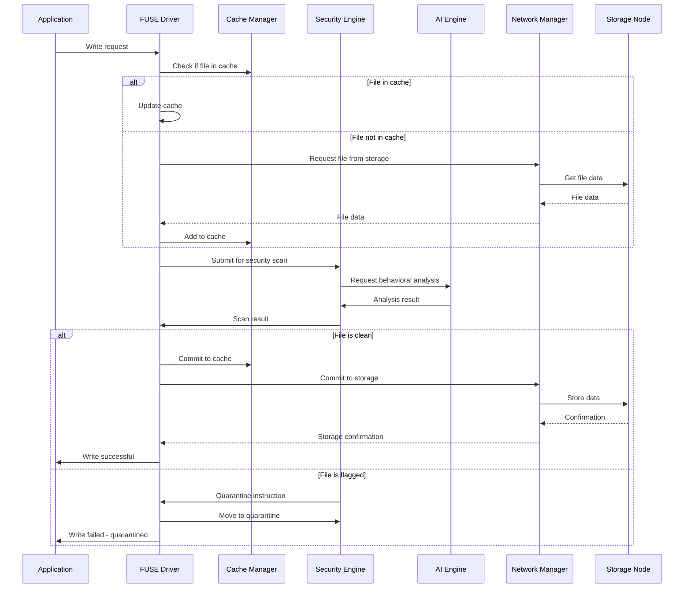
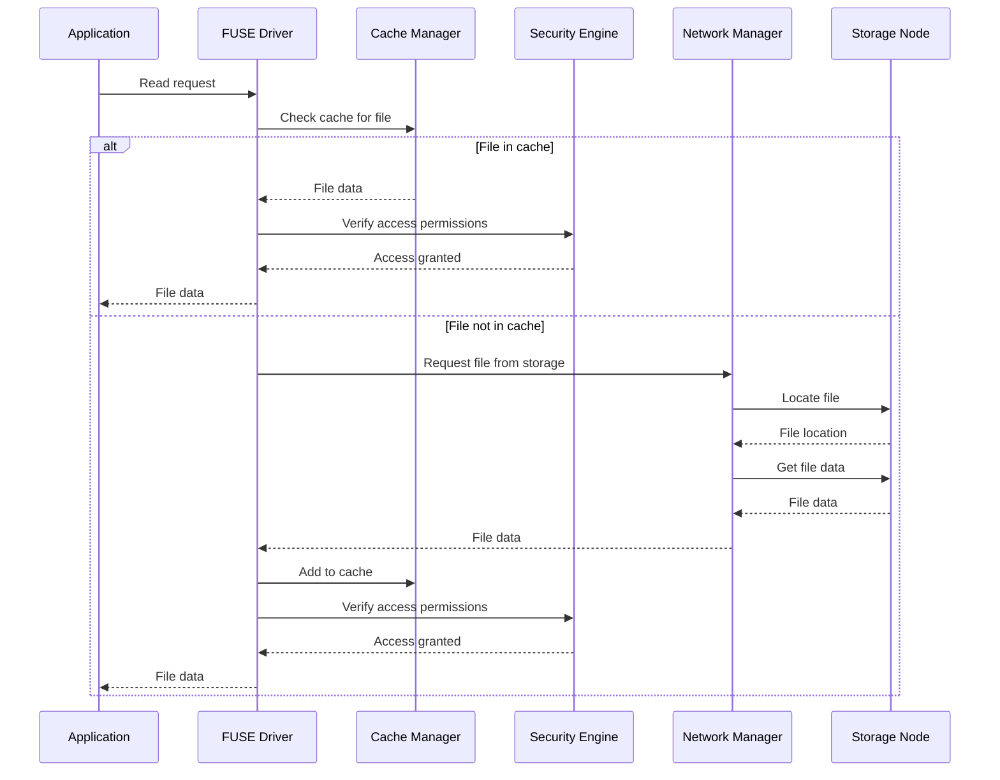
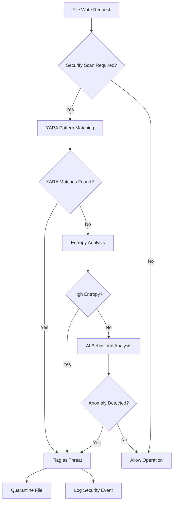
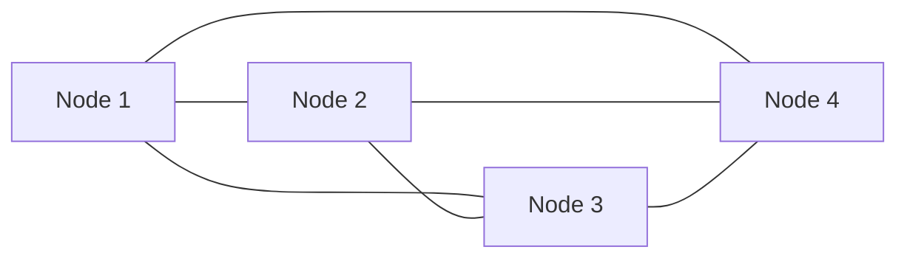

# 🏗️ SentinelFS Architecture Deep Dive

This document provides an in-depth look at the SentinelFS architecture, including module interactions, data flows, failure handling, and design decisions.

## 🧱 System Architecture

### High-Level Architecture

```mermaid
graph TB
    subgraph "Client Layer"
        APP[Applications]
        CLI[Command Line Tools]
        API_CLIENT[API Clients]
    end
    
    subgraph "FUSE Layer"
        FUSE_DRIVER[FUSE Driver]
        CACHE[Cache Manager]
        VFS[VFS Abstraction]
    end
    
    subgraph "Core Services"
        SEC[Security Engine]
        AI[AI Analyzer]
        NET[Network Manager]
        DB[(Audit Database)]
    end
    
    subgraph "Infrastructure"
        API[REST API]
        MON[Prometheus]
        GRAF[Grafana]
        RBAC[RBAC Engine]
    end
    
    subgraph "Storage Nodes"
        NODE1[Node 1
        (Metadata)]
        NODE2[Node 2
        (Data)]
        NODE3[Node 3
        (Replica)]
    end
    
    APP --> FUSE_DRIVER
    CLI --> API
    API_CLIENT --> API
    
    FUSE_DRIVER --> CACHE
    FUSE_DRIVER --> VFS
    CACHE --> SEC
    VFS --> SEC
    SEC --> AI
    SEC --> NET
    NET --> NODE1
    NET --> NODE2
    NET --> NODE3
    SEC --> DB
    AI --> DB
    RBAC --> DB
    API --> RBAC
    MON --> NET
    MON --> SEC
    MON --> AI
```

### Process Flow Architecture

The complete request flow from client to storage:

```
┌─────────────────┐    ┌──────────────────┐    ┌─────────────────┐
│   Application   │───▶│   FUSE Driver    │───▶│   VFS Layer     │
│   (e.g., cp)    │    │   (Kernel)       │    │   (Userspace)   │
└─────────────────┘    └──────────────────┘    └─────────────────┘
                            │                           │
                            ▼                           ▼
                    ┌──────────────────┐        ┌─────────────────┐
                    │   Cache Layer    │───────▶│ Security Engine │
                    │   (Read/Write)   │        │ (Scan & Check)  │
                    └──────────────────┘        └─────────────────┘
                            │                           │
                            ▼                           ▼
                    ┌──────────────────┐        ┌─────────────────┐
                    │ Network Manager  │◀───────┤   AI Engine     │
                    │ (Node Discovery, │        │ (Behavioral      │
                    │  Routing, Sync)  │        │  Analysis)      │
                    └──────────────────┘        └─────────────────┘
                            │
                            ▼
                    ┌──────────────────┐
                    │ Storage Cluster  │
                    │ (Distributed     │
                    │  Nodes)          │
                    └──────────────────┘
```

## 🧩 Module Architecture

### Core Modules & Responsibilities

| Module | Technology | Responsibility | Key Components |
|--------|------------|----------------|----------------|
| **`sentinel-fuse`** | Rust + FUSE | File system interface | FUSE driver, cache manager, I/O scheduler |
| **`sentinel-security`** | Rust + YARA | Real-time threat detection | YARA engine, entropy analyzer, quarantine |
| **`sentinel-ai`** | Python + PyTorch | Behavioral analysis | LSTM models, anomaly detector, feature extractor |
| **`sentinel-net`** | Rust + Tokio | Network optimization | Node discovery, routing, health checks |
| **`sentinel-db`** | PostgreSQL + Rust | Audit & policy storage | RBAC engine, audit logger, policy store |
| **`sentinel-api`** | Rust + Axum | Admin interface | REST API, auth handler, metrics exporter |
| **`sentinel-common`** | Rust | Shared utilities | Error types, config structs, serialization |

### Module Communication Patterns

#### Synchronous Communication

- FUSE → Security: File content scanning
- API → Database: Configuration updates
- Client → FUSE: File operations

#### Asynchronous Communication

- AI → Database: Model updates and learning
- Network → All: Health checks and topology updates
- Security → API: Threat notifications

#### Message Queues

For high-throughput operations, SentinelFS uses message queues:

```rust
// Example of internal messaging
enum InternalMessage {
    FileOperation(FileOpRequest),
    SecurityScan(ScanRequest),
    NetworkEvent(NodeEvent),
    AuditLog(AuditEntry),
    HealthUpdate(HealthStatus),
}
```

## 🔄 Data Flow Architecture

### Write Operation Flow



### Read Operation Flow



### Security Analysis Flow



## 🧪 Error Handling & Fault Tolerance

### Failure Scenarios & Handling

#### Node Failure

When a storage node fails:

1. **Detection**: Network manager detects node unresponsiveness
2. **Isolation**: Node is temporarily removed from routing table
3. **Redirection**: Requests are routed to replica nodes
4. **Recovery**: Failed node is brought back online or replaced
5. **Synchronization**: Data is synchronized from replicas

#### Network Partition

In case of network partition:

- **Detection**: Heartbeat timeouts indicate partition
- **Consistency**: System follows consistency model based on CAP theorem
- **Fallback**: Read-only mode for affected data
- **Recovery**: Automatic healing when partition resolves

#### Security Engine Failure

If security engine fails:

1. **Fallback**: System operates in reduced security mode
2. **Alerting**: Administrators are notified immediately
3. **Quarantine**: All new files are quarantined by default
4. **Recovery**: Security engine restarts and processes quarantined files

### Circuit Breaker Pattern

SentinelFS implements circuit breakers to prevent cascading failures:

```rust
enum CircuitState {
    Closed,    // Normal operation
    Open,      // Failure detected, requests blocked
    HalfOpen,  // Testing if failure is resolved
}

struct CircuitBreaker {
    state: CircuitState,
    failure_count: u32,
    last_failure: Instant,
    timeout: Duration,
}
```

## 🧠 AI Engine Architecture

### Model Architecture

The AI engine uses a hybrid approach combining multiple techniques:

```
┌─────────────────────────────────────────────────────────┐
│                      AI Engine                          │
├─────────────────────────────────────────────────────────┤
│  ┌─────────────┐  ┌─────────────┐  ┌─────────────────┐ │
│  │ LSTM Model  │  │ Isolation   │  │ Feature         │ │
│  │ (Temporal   │  │ Forest       │  │ Extractor       │ │
│  │  Patterns)  │  │ (Anomalies) │  │ (Access Stats)  │ │
│  └─────────────┘  └─────────────┘  └─────────────────┘ │
│              │           │                   │           │
│              └───────────┼───────────────────┘           │
│                          │                               │
│                   ┌─────────────┐                        │
│                   │ Ensemble    │                        │
│                   │ (Aggregator)│                        │
│                   └─────────────┘                        │
└─────────────────────────────────────────────────────────┘
```

### Real-Time Inference Pipeline

```
┌─────────────────┐    ┌─────────────────┐    ┌─────────────────┐
│  Access Event   │───▶│  Feature        │───▶│  Model          │
│  (User, File,   │    │  Extraction     │    │  Inference      │
│   Time, etc.)   │    │                 │    │                 │
└─────────────────┘    └─────────────────┘    └─────────────────┘
                            │                          │
                            ▼                          ▼
                   ┌─────────────────┐        ┌─────────────────┐
                   │  Anomaly Score  │───────▶│  Risk Assessment│
                   │                 │        │                 │
                   └─────────────────┘        └─────────────────┘
```

## 🔐 Security Architecture Deep Dive

### Defense-in-Depth Layers

```
┌─────────────────────────────────────────────────────────┐
│                    APPLICATION LAYER                    │
├─────────────────────────────────────────────────────────┤
│  🔐 JWT Authentication + MFA    │  🎭 RBAC Authorization│
├─────────────────────────────────────────────────────────┤
│          🤖 AI BEHAVIORAL ANALYSIS ENGINE               │
├─────────────────────────────────────────────────────────┤
│  🦠 YARA Malware Detection      │  📊 Entropy Analysis  │
├─────────────────────────────────────────────────────────┤
│  🔒 AES-256-GCM Encryption      │  🔑 Key Management    │
├─────────────────────────────────────────────────────────┤
│          📝 IMMUTABLE AUDIT LOGGING                     │
└─────────────────────────────────────────────────────────┘
```

### Zero-Trust Implementation

Each component implements zero-trust principles:

- **Authentication**: Every request is authenticated
- **Authorization**: Every action is authorized against policies
- **Validation**: All inputs are validated
- **Encryption**: All data is encrypted in transit and at rest
- **Auditing**: All actions are logged for audit purposes

## 🌐 Network Architecture

### Cluster Topology

SentinelFS supports multiple cluster topologies:

#### Linear Topology
```
Node 1 ←→ Node 2 ←→ Node 3 ←→ Node 4
```
- Simple to set up
- Good for small clusters
- Higher latency for distant nodes

#### Star Topology

- All nodes communicate directly
- Highest performance
- More complex to manage

### Load Balancing Strategy

SentinelFS uses intelligent load balancing based on:

- **Node health**: Avoid unhealthy nodes
- **Latency**: Prefer lower-latency nodes
- **Load**: Distribute based on node utilization
- **Data locality**: Prefer nodes with requested data

## 🔧 Configuration Management

### Dynamic Configuration Updates

SentinelFS supports runtime configuration updates:

```rust
// Configuration update mechanism
pub struct ConfigManager {
    config: RwLock<Configuration>,
    subscribers: Vec<UnboundedSender<ConfigUpdate>>,
}

impl ConfigManager {
    pub async fn update_config(&self, new_config: Configuration) -> Result<()> {
        // Validate new configuration
        self.validate_config(&new_config)?;
        
        // Apply changes atomically
        *self.config.write().await = new_config;
        
        // Notify all subscribers
        for subscriber in &self.subscribers {
            subscriber.send(ConfigUpdate::Reload)?;
        }
        
        Ok(())
    }
}
```

### Configuration Validation

All configuration changes are validated before application:

- Schema validation using Serde
- Semantic validation (e.g., port ranges, path accessibility)
- Dependency validation (e.g., required services)
- Performance impact assessment

## 📊 Monitoring & Observability

### Internal Metrics System

SentinelFS exposes metrics through multiple systems:

| Metric Type | Purpose | Labels |
|-------------|---------|---------|
| Counters | Track events | `operation`, `result`, `node` |
| Gauges | Monitor state | `state`, `node` |
| Histograms | Measure latency | `operation`, `node` |
| Summaries | Track percentiles | `operation`, `node` |

### Distributed Tracing

Requests are traced across all components:

```
Trace ID: 12345-abcde-67890
├── FUSE Driver: File read request (10ms)
│   ├── Cache Check: Hit (1ms)
│   ├── Security Check: Passed (5ms)
│   └── Return to Client: Success (4ms)
└── DB Log: Audit entry recorded (2ms)
```

## 🔄 Scalability Considerations

### Horizontal Scaling

SentinelFS can scale horizontally by:

- Adding more storage nodes
- Distributing load across gateway nodes
- Sharding data across multiple clusters
- Using read replicas for high availability

### Vertical Scaling

Components can be scaled vertically by adjusting:

- CPU cores for encryption and AI processing
- Memory for caching and buffering
- Network bandwidth for higher throughput
- Storage IOPS for better performance

## 🧩 Integration Architecture

### FUSE Integration

SentinelFS integrates with the Linux kernel through FUSE:

```c
// Simplified FUSE operations
static struct fuse_operations sentinelfs_oper = {
    .getattr    = sentinelfs_getattr,
    .readdir    = sentinelfs_readdir, 
    .open       = sentinelfs_open,
    .read       = sentinelfs_read,
    .write      = sentinelfs_write,
    .create     = sentinelfs_create,
    .unlink     = sentinelfs_unlink,
    .chmod      = sentinelfs_chmod,
    .chown      = sentinelfs_chown,
};
```

### Third-Party Integrations

SentinelFS provides integration points for:

- **SIEM Systems**: Real-time security event streaming
- **Backup Tools**: Native backup and restore APIs
- **Monitoring Tools**: Prometheus, Grafana, ELK stack
- **Orchestration**: Kubernetes, Docker, systemd
- **Identity Providers**: LDAP, Active Directory, OAuth

## 🚨 Failover and Recovery

### Automatic Failover

SentinelFS implements automatic failover with:

- **Health monitoring**: Continuous node health checks
- **Failure detection**: Fast detection of node failures
- **Automatic redirection**: Seamless traffic redirection
- **Data consistency**: Maintains data consistency during failover

### Recovery Procedures

After a failure, SentinelFS follows these steps:

1. **Assessment**: Determine scope and cause of failure
2. **Isolation**: Isolate failed components
3. **Recovery**: Restore services from healthy replicas
4. **Verification**: Verify data integrity and consistency
5. **Monitoring**: Monitor for additional issues

This architecture enables SentinelFS to maintain high availability and data integrity even during component failures or network partitions.

_last updated 29.09.2025_