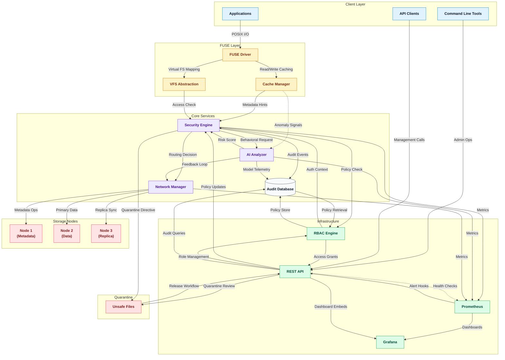

# 🏗️ SentinelFS Main Architecture

## 📋 Table of Contents
- [Architecture Diagram](#architecture-diagram)
- [Component Descriptions](#component-descriptions)
- [Data Flow](#data-flow)
- [Security Layer](#security-layer)

## Architecture Diagram

## Component Descriptions

### Client Layer
- **Applications**: Standard applications that access the file system through POSIX-compliant operations
- **Command Line Tools**: Administrative tools for system management
- **API Clients**: Applications that interact with the REST API for advanced operations

### FUSE Layer
- **FUSE Driver**: Implements the FUSE protocol to interface with the Linux kernel
- **Cache Manager**: Handles read/write caching to improve performance
- **VFS Abstraction**: Provides virtual file system abstractions

### Core Services
- **Security Engine**: Performs real-time threat detection and access control
- **AI Analyzer**: Applies machine learning models for behavioral analysis
- **Network Manager**: Manages node discovery, routing, and health monitoring
- **Audit Database**: Stores immutable audit logs and security events

### Infrastructure
- **REST API**: Provides administrative and operational interfaces
- **RBAC Engine**: Manages role-based access control
- **Prometheus**: Collects and stores metrics
- **Grafana**: Provides visualization dashboards

### Storage Nodes
- **Metadata Node (Node 1)**: Manages file metadata and directory structure
- **Data Node (Node 2)**: Stores actual file data
- **Replica Node (Node 3)**: Maintains replicated data for high availability

### Quarantine
- **Unsafe Files**: Isolated storage for files flagged as potentially malicious

## Data Flow

The diagram illustrates the flow of data and operations through the system:

1. **Client Applications** interact with the system through standard POSIX operations
2. **FUSE Driver** handles the translation between POSIX operations and system services
3. **Cache Manager** optimizes read/write operations
4. **Security Engine** performs real-time threat detection before data reaches storage
5. **AI Analyzer** provides behavioral analysis to detect anomalies
6. **Network Manager** routes operations to appropriate storage nodes
7. **Storage Nodes** provide distributed storage with replication
8. **Audit Database** maintains immutable logs of all operations

## Security Layer

The architecture includes multiple security layers:

- **Security Engine** performs real-time scanning using YARA rules and entropy analysis
- **AI Analyzer** detects behavioral anomalies that might indicate security threats
- **RBAC Engine** enforces access controls based on user roles and permissions
- **Quarantine System** isolates potentially malicious files
- **Audit Database** maintains immutable logs for compliance and forensic analysis

This architecture ensures that security is integrated at every level of the system rather than being an afterthought, creating a zero-trust environment where all operations are verified and logged.

_last updated 01.10.2025_